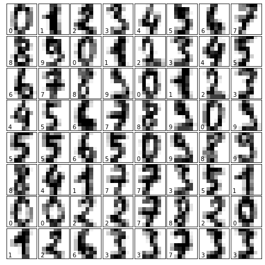

# Machine Recognition of Handwritten Numbers

## 1. Introduction

### 1.1. Business Problem

Currently, there are processes that, to be valid or authenticated, have to be handwritten. Most of these manuscripts can only be recognized by a human being or by very few applications, so the need to process information of this nature is merely existent. That is why it is important to work with a program that allows the manuscripts to be processed and interpreted by a machine in order to obtain a substantial saving of resources in terms of money and time.

### 2.1. Interest

The application of this model will be of interest to multiple sectors. For example, in the case of the financial sector, it may be applied for the recognition of the values of handwritten checks. As for accounting, books that have not been digitized can now be digitized thanks to this model. On the other hand, when it comes to grading systems at the educational level, subject exams that involve numbers, such as mathematics, physics or chemistry, may be more easily corrected due to this facility.

## 2. Data Acquisition and Cleaning

### 2.1. Data Source

The data was extracted normalized bitmaps of handwritten digits from a preprinted form. From a total of 43 people, 30 contributed to the training set and different 13 to the test set. 32x32 bitmaps are divided into non overlapping blocks of 4x4 and the number of on pixels are counted in each block. This generates an input matrix of 8x8 where each element is an integer in the range 0..16. This reduces dimensionality and gives invariance to small distortions. 

Attribute Information:

All input attributes are integers in the range 0..16.
The last attribute is the class code 0..9

[Source](https://archive.ics.uci.edu/ml/datasets/optical+recognition+of+handwritten+digits)

### 2.2. Data Exploration

There are 1797 samples and that there are 64 features. Because you have 1797 samples, you also have 1797 target values.

But all those target values contain 10 unique values, namely, from 0 to 9. In other words, all 1797 target values are made up of numbers that lie between 0 and 9. This means that the digits that your model will need to recognize are numbers from 0 to 9.

Lastly, you see that the images data contains three dimensions: there are 1797 instances that are 8 by 8 pixels big. You can visually check that the images and the data are related by reshaping the images array to two dimensions: digits.images.reshape((1797, 64)).

